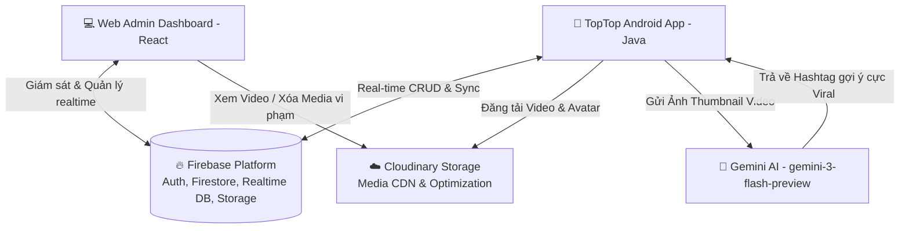

# 📱 TopTop (TikTok Clone Ecosystem) - Hệ Sinh Thái Mạng Xã Hội Video Ngắn Tích Hợp AI

[](https://developer.android.com/)
[](https://react.dev/)
[](https://firebase.google.com/)
[](https://deepmind.google/technologies/gemini/)
[](https://cloudinary.com/)

**TopTop** là một hệ sinh thái mạng xã hội chia sẻ video ngắn hiện đại được xây dựng dựa trên mô hình của TikTok. Dự án kết hợp ứng dụng di động native dành cho người dùng và cổng thông tin quản trị Web App dành cho ban kiểm duyệt và quản trị viên, tích hợp trí tuệ nhân tạo (Gemini AI) cùng các giải pháp lưu trữ đám mây tối ưu.

---

## 🗺️ Tổng Quan Kiến Trúc Hệ Thống (System Architecture)

Hệ thống được thiết kế theo mô hình Client - Server không đồng bộ, sử dụng **Firebase** làm cơ sở dữ liệu thời gian thực và quản lý tài khoản bảo mật, **Cloudinary** để lưu trữ và tối ưu hóa tài nguyên media dung lượng lớn, kết hợp với dịch vụ Generative AI **Gemini** để mang lại trải nghiệm thông minh cho người dùng.



---

## 🛠️ Công Nghệ & Thư Viện Sử Dụng (Tech Stack)

### 1. 📱 TopTop Mobile App (`TikTokCloneProject`)
Ứng dụng di động native chạy trên nền tảng Android, mang lại trải nghiệm mượt mà, lướt video không độ trễ và hỗ trợ camera quay dựng tiện lợi.
*   **Ngôn ngữ chính:** Java 17
*   **Android SDK:** Compile SDK 34, Min SDK 24
*   **Trình phát Video:** `ExoPlayer` (v2.19.0) - Đảm bảo tải trước (pre-caching), phát trực tuyến mượt mà và tiết kiệm băng thông.
*   **Lưu trữ Media:** `Cloudinary Android SDK` (v2.3.1) - Xử lý tải lên, nén và phân phối video/hình ảnh qua CDN tốc độ cao.
*   **Trí tuệ Nhân tạo:** `Google Generative AI SDK` (v0.9.0) - Gọi API Gemini 3 Flash trực tiếp để phân tích hình ảnh và tạo nội dung.
*   **Xử lý hình ảnh:** `Glide` (v4.15.1) - Đọc và cache hình ảnh tối ưu.
*   **Cơ sở dữ liệu & Authentication:** `Firebase BOM` (Authentication, Cloud Firestore, Realtime Database, Cloud Storage).
*   **UI Helpers:** `CircleImageView` (Ảnh tròn đại diện), `RecyclerView` (Danh sách cuộn mượt mà), `android-gif-drawable` (Hỗ trợ định dạng ảnh động).

### 2. 💻 TopTop Management Portal (`TikTokManagement`)
Trang web quản trị tối tân dành cho Admin và Moderator để giám sát, điều phối và bảo vệ cộng đồng người dùng.
*   **Giao diện & Logic:** `React.js` + `TypeScript` + `Vite` (Khởi chạy cực nhanh).
*   **Thiết kế & CSS:** `TailwindCSS` với hệ thống màu Dark Mode cao cấp (Glassmorphic UI).
*   **Bộ icon:** `Lucide React`
*   **Xác thực và Dữ liệu:** `Firebase Auth` & `Cloud Firestore` (Đồng bộ thời gian thực 2 chiều với thiết bị di động).

---

## ✨ Các Tính Năng Nổi Bật

### 📱 1. Trên Ứng Dụng Di Động Android
*   **Trình xem video cuộn dọc vô tận (Home Feed):** Sử dụng `ExoPlayer` được tinh chỉnh cấu hình giúp tự động chuyển đổi video khi vuốt lên/xuống, tự động phát và lặp lại mượt mà như TikTok.
*   **Tạo video trực tiếp (Camera & Upload):** Tích hợp camera quay phim trực tiếp hoặc chọn video từ thư viện, thêm mô tả chi tiết trước khi đăng tải.
*   **Gợi ý Hashtag Viral bằng AI (Gemini Integration):** 
    > [!TIP]
    > **Tính năng độc quyền:** Khi chuẩn bị đăng video, người dùng có thể gửi ảnh thumbnail của video cho **Gemini AI**. AI sẽ đóng vai trò là chuyên gia Marketing Việt Nam phân tích ngữ cảnh hình ảnh để tự động đề xuất 5 - 10 hashtag tiếng Việt cực kỳ thịnh hành (`#xuhuong`, `#viral`, v.v.), giúp video dễ tiếp cận người xem hơn.
*   **Hệ thống Tương tác Thời gian thực:** Thích video, bình luận dưới video, chia sẻ tài khoản.
*   **Mạng lưới Kết nối Xã hội (Follow System):** Theo dõi/Hủy theo dõi người dùng khác, quản lý danh sách Followers và Following.
*   **Hộp thư & Chat Trực tiếp (Direct Messages):** Nhắn tin trò chuyện trực tiếp (real-time chat) giữa các người dùng với nhau qua Firebase Realtime Database.
*   **Quản lý Tài khoản & Hồ sơ Cá nhân:** Cập nhật ảnh đại diện (avatar), thay đổi thông tin giới thiệu (bio), đổi mật khẩu hoặc xóa tài khoản vĩnh viễn bảo mật.
*   **Tìm kiếm thông minh:** Tìm kiếm người dùng, tìm video theo từ khóa hoặc hashtag cụ thể.

### 💻 2. Trên Trang Quản Trị Web App
*   **Phân quyền truy cập an toàn (Role-based Authorization):** Phân chia rõ ràng 2 vai trò nhân sự quản lý:
    *   `Admin`: Quản trị viên cấp cao nhất, quản lý cài đặt hệ thống và phân quyền nhân sự.
    *   `Moderator (Kiểm duyệt viên)`: Xem xét, duyệt video nội dung và giải quyết các báo cáo vi phạm.
*   **Bảng Điều Khiển Tổng Quan (Dashboard):** Biểu đồ trực quan sinh động thống kê số lượng người dùng mới, video tải lên và lượng tương tác (views, likes, comments).
*   **Kiểm Duyệt Video (Moderation):** 
    *   Danh sách video chờ duyệt. Kiểm duyệt viên có thể xem trực tiếp video, duyệt công khai hoặc từ chối xóa video.
    *   Tích hợp AI kiểm duyệt tự động để cảnh báo sớm video chứa nội dung không lành mạnh.
*   **Quản lý Người dùng (Users):** Khóa (ban) tài khoản vi phạm tiêu chuẩn cộng đồng, thay đổi vai trò (User -> Moderator), xem lịch sử hoạt động của người dùng.
*   **Xử lý Báo cáo (Reports Queue):** Tiếp nhận trực tiếp các báo cáo vi phạm nội dung từ ứng dụng Android gửi lên, hiển thị chi tiết nguyên nhân báo cáo và hỗ trợ xử lý tức thời.
*   **Nhật ký Hoạt động (Audit Logs):** Ghi nhận lịch sử thao tác của các Admin/Moderator để tránh lạm quyền và kiểm tra minh bạch.

---

## 📁 Cấu Trúc Dự Án (Project Structure)

Thư mục chính chứa hai dự án độc lập nhưng bổ trợ chặt chẽ cho nhau:

```text
TopTop/
├── TikTokCloneProject/         # Mã nguồn ứng dụng di động Android (Java)
│   ├── app/
│   │   ├── build.gradle        # Cấu hình thư viện và khóa API của Android
│   │   └── src/main/
│   │       ├── AndroidManifest.xml
│   │       ├── java/com/example/tiktokcloneproject/
│   │       │   ├── activity/   # 30 màn hình chính (CameraActivity, ChatActivity, EditProfileActivity...)
│   │       │   ├── adapters/   # Các adapter hiển thị danh sách (VideoAdapter, CommentAdapter...)
│   │       │   ├── fragment/   # Các tab điều hướng chính (ProfileFragment, SearchFragment, VideoFragment...)
│   │       │   ├── helper/     # Các công cụ hỗ trợ (GeminiHelper, LegacyHashtagFixer...)
│   │       │   └── model/      # Định nghĩa thực thể dữ liệu (User, Video, Comment, Chat...)
│   │       └── res/            # Tài nguyên hình ảnh, bố cục XML layout
│   └── build.gradle            # Cấu hình Gradle mức dự án
│
├── TikTokManagement/           # Mã nguồn Web App quản trị (React + TypeScript)
│   ├── src/
│   │   ├── components/         # Các Component dùng chung (layout Sidebar, TopHeader...)
│   │   ├── pages/              # 6 Màn hình quản lý nghiệp vụ
│   │   │   ├── Dashboard.tsx   # Trang thống kê, biểu đồ hệ thống
│   │   │   ├── LoginPage.tsx   # Đăng nhập dành cho quản trị viên
│   │   │   ├── Moderation.tsx  # Giao diện duyệt / xóa video người dùng
│   │   │   ├── Reports.tsx     # Xử lý báo cáo vi phạm
│   │   │   ├── Settings.tsx    # Cài đặt và phân quyền quản trị viên
│   │   │   └── Users.tsx       # Xem danh sách, tìm kiếm và khóa tài khoản
│   │   ├── App.tsx             # Điều hướng tab và kiểm tra quyền đăng nhập
│   │   └── main.tsx            # Điểm khởi chạy của dự án Web
│   ├── package.json            # Quản lý thư viện dependencies của React
│   └── vite.config.ts          # Cấu hình Vite bundler
│
└── README.md                   # Tài liệu tổng quan này
```

---

## 🗄️ Thiết Kế Cơ Sở Dữ Liệu (Firestore Data Schema)

Hệ thống lưu trữ trên **Google Cloud Firestore** theo cấu trúc các Document Collections liên kết động:

| Collection | Nội dung lưu trữ | Các trường dữ liệu chính |
| :--- | :--- | :--- |
| `users` | Thông tin người dùng | `uid`, `email`, `name`, `username`, `avatarUrl`, `bio`, `role` (admin/moderator/user), `createdAt`, `status` (active/banned) |
| `videos` | Danh sách video đăng tải | `videoId`, `publisherId`, `videoUrl`, `description`, `thumbnailUrl`, `likesCount`, `commentsCount`, `status` (pending/approved/rejected), `hashtags`, `createdAt` |
| `comments` | Các bình luận dưới video | `commentId`, `videoId`, `userId`, `text`, `createdAt` |
| `reports` | Báo cáo vi phạm nội dung | `reportId`, `reporterId`, `targetVideoId`, `reason`, `details`, `status` (pending/resolved), `createdAt` |
| `chats` | Tin nhắn trao đổi trực tiếp | `chatId`, `senderId`, `receiverId`, `message`, `timestamp` |

---

## 🚀 Hướng Dẫn Cài Đặt & Chạy Thử (Setup & Installation)

### 1. Cấu hình Cơ sở dữ liệu Firebase & Cloudinary
1. Tạo một dự án mới trên [Firebase Console](https://console.firebase.google.com/).
2. Bật các dịch vụ: **Authentication** (Email/Password), **Cloud Firestore**, và **Realtime Database**.
3. Tạo tài khoản [Cloudinary](https://cloudinary.com/) để lấy `Cloud Name`, `API Key`, và `Upload Preset` phục vụ việc upload video từ điện thoại.

---

### 2. Thiết lập & Chạy App Android (`TikTokCloneProject`)

#### **Yêu cầu hệ thống:**
*   Android Studio Jellyfish trở lên.
*   Java Development Kit (JDK) 17.
*   Thiết bị Android thật hoặc Máy ảo Android (API level 24+).

#### **Các bước thực hiện:**
1. Mở Android Studio, chọn **File > Open** và dẫn tới thư mục `TikTokCloneProject`.
2. Tải file cấu hình dịch vụ `google-services.json` từ dự án Firebase của bạn và dán vào thư mục:
   `TikTokCloneProject/app/`
3. Tạo một file tên là `local.properties` tại thư mục gốc `TikTokCloneProject/` (nếu chưa có) và thêm cấu hình khóa API Gemini:
   ```properties
   # Thêm khóa API Gemini cá nhân của bạn để kích hoạt tính năng AI gợi ý Hashtag
   GEMINI_API_KEY=AIzaSy...YourActualGeminiApiKey
   ```
4. Đồng bộ hóa Gradle bằng cách nhấn nút **Sync Project with Gradle Files** ở thanh công cụ.
5. Kết nối thiết bị/máy ảo và nhấn **Run** (phím tắt `Shift + F10`) để cài đặt ứng dụng lên máy.

---

### 3. Thiết lập & Chạy Web App Quản Trị (`TikTokManagement`)

#### **Yêu cầu hệ thống:**
*   Node.js (phiên bản v18 trở lên).
*   Trình quản lý gói `npm` hoặc `yarn`.

#### **Các bước thực hiện:**
1. Sử dụng terminal di chuyển vào thư mục dự án Web:
   ```bash
   cd TikTokManagement
   ```
2. Cài đặt các thư viện phụ thuộc:
   ```bash
   npm install
   ```
3. Tạo file `.env` tại thư mục `TikTokManagement/` dựa trên mẫu `.env.example`, điền các khóa cấu hình kết nối Firebase của bạn:
   ```env
   VITE_FIREBASE_API_KEY=AIzaSy...
   VITE_FIREBASE_AUTH_DOMAIN=toptop-project.firebaseapp.com
   VITE_FIREBASE_PROJECT_ID=toptop-project
   VITE_FIREBASE_STORAGE_BUCKET=toptop-project.appspot.com
   VITE_FIREBASE_MESSAGING_SENDER_ID=...
   VITE_FIREBASE_APP_ID=1:...
   ```
4. Khởi động môi trường phát triển (Local Server):
   ```bash
   npm run dev
   ```
5. Mở trình duyệt web và truy cập địa chỉ được hiển thị trên Terminal (mặc định là `http://localhost:5173`) để sử dụng trang quản trị.

---

## 👥 Thành Viên Thực Hiện (Authors & License)
*   **Đề tài:** Xây dựng ứng dụng Mạng xã hội video ngắn TopTop (TikTok Clone) - Môn Phát triển Ứng dụng Di động.
*   **Bản quyền:** Mã nguồn thuộc dự án giáo dục đại học, được phát hành theo giấy phép **MIT License**. Vui lòng ghi rõ nguồn khi tái sử dụng tài nguyên.
